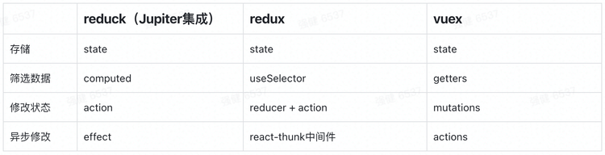

# React-Redux

* [React Redux 与胖虎 | 掘金](https://juejin.cn/post/6844903549747331085)
* [react-redux一点就透，我这么笨都懂了！|掘金](https://juejin.cn/post/6844903602926927880#heading-5)
* [详解react、redux、react-redux之间的关系｜简书](https://www.jianshu.com/p/728a1afce96d)
* 

## react-redux与redux的关系

* [React Redux](https://link.juejin.cn/?target=https%3A%2F%2Fgithub.com%2Freactjs%2Freact-redux) 是 [Redux](https://link.juejin.cn/?target=https%3A%2F%2Fredux.js.org%2F) 的 React 版，Redux 本身独立于其他框架而存在，又可以结合其他视图框架使用，比如此处的 React。


- Store 是整个 React Redux 应用总的状态容器，是一个对象
  - 维持应用的 state； 
  - 提供 getState() 方法获取 state； 
  - 提供 dispatch(action) 方法更新 state；
  - 通过 subscribe(listener) 注册监听器; 
  - 通过 subscribe(listener) 返回的函数注销监听器。
- Action 也是一个对象，表明事件，需要有 `type` 字段
- Reducer 是一个函数，会根据不同 Action 来决定返回不同的数据


## connect

* 连接 UI 组件，生成新的含有逻辑的组件

```react
import { connect } from 'react-redux';
import Counter from './Counter';

function mapStateToProps(state) {
    return {
        count: state.count
    }
}

function mapDispatchToProps(dispatch) {
    return {
        onAdd: () => dispatch({type: 'ADD_COUNT'})
    }
}

const newComponent = connect(mapStateToProps, mapDispatchToProps)(Counter);
```

```react
function mapStateToProps(state, ownProps) {
  	return {};
}
```

##  Provider 

* 作为顶层组件将全局 Store 引入

```jsx
const store = createStore(reducer);

 <Provider store={store}>
 </Provider>
```


Provider 内的任何一个组件，如果需要使用 state 中的数据，就必须是「被 connect 过的」组件——使用 connect 方法对「你编写的组件（MyComp）」进行包装后的产物。


* connect方法将store上的getState 和 dispatch 包装成组件的props


## redux、vuex 与 reduck





### 类 的状态管理方案

* [redux-toolkit | github](https://github.com/reduxjs/redux-toolkit)

* [rematch | github](https://github.com/rematch/rematch)
* [dva | github](https://github.com/dvajs/dva/blob/master/README_zh-CN.md)

## 异步方案

* [redux-thunk | github](https://github.com/reduxjs/redux-thunk)
* [redux-saga | github](https://github.com/redux-saga/redux-saga)

