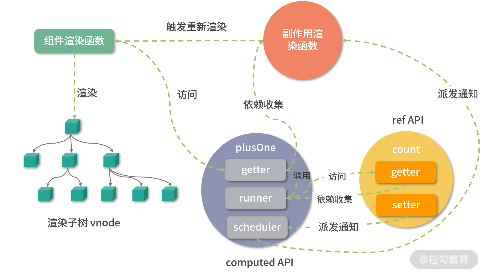

# Vue 3

* [v3中文文档](https://v3.cn.vuejs.org/guide/introduction.html)

* [你可以手写Vue3的响应式原理吗？| 掘金 ｜前端森林](https://juejin.cn/post/6921530159099510791#comment)


## Computed

* 函数
  * 标准化函数: getter, setter
  * 创建副作用函数runner: 对getter做了一层封装
  * 创建computed对象并返回：该对象的getter会根据是否dirty来执行runner, 并做依赖收集，setter设置newValue
* 特点（空间换时间的优化思想）
  * 延迟计算：当我们访问计算属性时，才会真正运行输入的getter函数
  * 缓存：缓存上次的计算结果value(闭包)，只有当dirty为true, 才重新计算结果value 。




## new Proxy  & Object.defineProperty

* 两者单次执行只劫持 **对象本身**，不会劫持子对象的变化， 通过递归劫持内部所有对象。
* vue3 Proxy  在对象 **属性被访问** 时递归子对象执行 reactive, 是一种 **延迟** 定义子对象响应式的实现，性能优与 vue2,  vue2 的 Object.defineProperty 是在初始化阶段，即定义劫持对象时就已经递归执行了。


## initialVNode  & subTree

* initialVNode: 组件 vnode ,  如 ``<hello></hello> ``  所渲染生产的vnode
* subTree: 子树 vnode, Hello **组件内部** 整个Dom节点 经过 renderComponentRoot 渲染生成的 subTree


## 属性访问优先级

* setupState
* data
* props
* ctx


## watch 侦听器

* watch api
  * () => reactive()
  
    > 侦听一个 getter 函数,返回一个响应式对象: () => state.count

  * ref() 
  
    > 侦听一个响应式对象: count
  
  * [ref(), ref(), ...]
  
    > 侦听多个响应式对象: [count, count2]
  
* doWatch
  * 标准化 source 
  * 构造 applyCb 回调函数 
  * 创建 scheduler 时序执行函数 
  *  创建 effect 副作用函数 
  *  返回侦听器销毁函数 

* Watch 减少 traverse 次数

  * 侦听 state.count.a.b

  ```js
  // 
  watch(state.count.a, (newVal, oldVal) => { 
    console.log(newVal) 
  }) 
  // 更优
  watch(() => state.count.a.b, (newVal, oldVal) => { 
    console.log(newVal) 
  }) 
  ```

  

