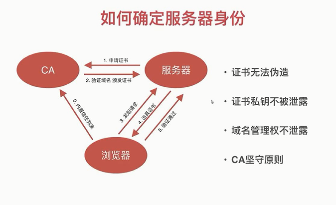

# Safety

* [寒冬求职之你必须要懂的Web安全](https://juejin.im/post/5cd6ad7a51882568d3670a8e)


## 1. XSS (Cross Site Scripting) 

> **跨站脚本攻击**
>
> 攻击模式：注入各种脚本，节点，以到目的，
>
> 防御：转译，X-XSS-Protection，CSP等


### 攻击分类

* 反射型(非持久型)：url参数直接注入
* 存储型(持久性)：存储到DB后读取时注入
* DOM型

### 攻击注入点

* HTML 节点内容
* HTML 属性
* Js
* 富文本

### 应对方案

* 浏览器自带功能

  > X-XSS-Protection  默认打开
  >
  > 只防御 参数出现在HTML内容和属性中

```js
// koa2
ctx.set('X-XSS-Protection', 1) // 默认开启
ctx.set('X-XSS-Protection', 0) // 关闭
```

* HTML

``` js
cosnt escapeHtml = function(str) {
    if(!str) return ''
    str = str.replace(/&/g, '$amp;')
    str = str.replace(/</g, '&lt;')
    str = str.replace(/>/g, '&gt;')
    str = str.replace(/"/g, '&quto;')
    str = str.replace(/'/g, '$#39;')
}
html 属性使用引号包裹，而不是裸露
  
 
```

* SOL

```
const replaceSql = value => {
	if (value || value.length) {
		return value
	}
	return value.replace(//)
}
```


* Js

```js
const escapeForJs = function(str) {
	if(!str) return ''
	str = str.replace(/\\/g, '\\\\')
	str = str.replace(/"/g, '\\"')
    str = str.replace(/'/g, '\\'')
	return str
}
直接用JSON.Stringify() 效果更好。
```

* 富文本

```js
// 黑名单
const xssFilter = function(html) {
	if(!html) return ''
	html = html.replace(/<\s*\/?\s*script\s*>/, '')
	html = html.replace(/javascript:[^'"]*/, '')
	html = html.replace(/onerror\s*=\s['"]?[^'"]*['"]?/g, '')
}	
```

```js
// 白名单
const xssFilter = function(html) {
	if(!html) return ''
    // 导入cheerio库
	const cheerio = require('cheerio')
	const $ = cheerio.load(html)
	// 白名单
	const whiteList = {
		img: ['scr']，
        font: ['color', 'size'],
        a: ['href']
	}
	$('*').each(function(index, elem){
		//console.log('this is elem', elem)
        if(!whiteList.[elem.name]){
            $(elem).remove()
            return
        }
        for(let attr in elem.attribs) {
            if(whiteList[elem.name].includes(attr)){
                $(elem).attr(attr, null)
            }
        }
	})
    return $.html()
}

```

### CSP

> "网页安全政策"（Content Security Policy)
>
> [Content Security Policy 入门教程](http://www.ruanyifeng.com/blog/2016/09/csp.html)


## 2. CSRF (Cross Site Request Forge)

> **跨站请求伪造**
>
> A: 被攻击方， B: 攻击方
>
> B网站`伪造A网站的请求`，并携带了A网站用户的cookie，可以骗过后端验证，伪装成用户，进行攻击
>
> [Content-Security-Policy | mdn](https://developer.mozilla.org/en-US/docs/Web/HTTP/Headers/Content-Security-Policy)

* [`frame-ancestors`](https://developer.mozilla.org/en-US/docs/Web/HTTP/Headers/Content-Security-Policy/frame-ancestors)

  Specifies valid parents that may embed a page using ...

### SameSite

> [Cookie 的 SameSite 属性](http://www.ruanyifeng.com/blog/2019/09/cookie-samesite.html)


### 验证码  (体验不好)

> 验证码库：[*ccap* - *npm*](https://www.baidu.com/link?url=7mys-lAevtJQPjAhezdXrVmyk0_EJHVbdUcu9x33_nuM09KF9g0XEIRvvhpWFaCm&wd=&eqid=8d3d97de00001a28000000055e69004c)


### token (主流)

> 需要提交时，下发token, 提交时携带，并进行比较是否匹配


### referer (不安全，可以被更改)

```js
//koa
const referer = ctx.request.headers.referer
const myHost = /^https?:\/\/hostname/
if(!myHost.test(referer)) {
    throw new Error('非法请求')
}
```


## 3. Cookies问题


### cookies特性

* Name
* Value

* Domain 

  > 域名

* Path

  > 路径

* Expires/Max-Age 

  > 有效期

* Http-only

  > true: js不等操作cookie ， 包括获取，查看，更改等
  >
  > 仅http 可以覆盖

* Secure

  > true: 请求需要使用https

* SameSite

  * [预测最近面试会考 Cookie 的 SameSite 属性](https://juejin.im/post/5e718ecc6fb9a07cda098c2d)

  > Google 
  >
  > cookie的限制
  >
  > None: 不限制
  >
  > Lax：
  >
  > Strict

  


### Cookies - 登陆用户凭证

#### userId

> 直接下发 usrId


#### userId + 签名

> 下发 userId 和 签名(防信息篡改)

```js
const key = '328-we0dDS@ 2.[]'

const cryptoUserId = function(userId) {
	// 导入自带库crypto
	const crypto = require('crypto')
    const sign = crypto.createHmac('sha2256', key)
    sign.update(''+userId) // 加密
    return sign.digest('hex') // 返回格式16位
}
```

#### sessionId

> 下发 **随机** 的id, 用户信息存储在服务器

```js
const session = {}
const cache = {}

session.set = function(userId, obj) {
    const sessionId = Math.random()
    if(!cache[sessionId]) {
        cache[sessionId] = {}
    }
    cache[sessionId].content = obj
    return sessionId
}

session.get = function(sessionId) {
    return cache[sessionId] && cache[sessionId].content
}
```

#### 加密

> 私人加密

```js
const crypto = require('crypto')
const key = '29d.[1]2^s48-+'
// 加密
const cipher = crypto.createCipher('des', key)
let text = cipher.update('hello world', 'utf8', 'hex')
text += cipher.final('hex')
// 解密
const decipher = crypt.createDecipher('des', key)
let originalText = decipher.udpate(text, 'hex', 'utf8')
originalText += decipher.final('utf8')

```


## 4. 点击劫持

>手段：frame 内嵌被攻击者的网站


### 防御

#### Js 禁止内嵌

> js容易被禁，防御就失效


#### X-FRAME-OPTIONS 禁止内嵌(推荐)

>[X-Frame-Options](https://developer.mozilla.org/zh-CN/docs/Web/HTTP/X-Frame-Options)
>
>```js
>X-Frame-Options: deny   //禁止所有内嵌
>X-Frame-Options: sameorigin  //限制为同源
>X-Frame-Options: allow-from https://example.com/   //允许某些网站
>```


#### 其他辅助手段

> 验证码验证，可以被攻破，但降低了些风险

 

## 5. 传输安全


### HTTP传输窃听

##### 查看链路

> windows: ` tracert www.baidu.com`
>
> mac:  `traceroute ww.baidu.com`


### Build HTTPS 

> TLS (SSL) 加密



#### 申请证书

* [手动申请证书 | sslforfree](https://www.sslforfree.com/)

* 脚本申请(真实环境推荐)

  > 下载脚本
  >
  > https://get.acme.sh/

  ```
  curl https://get.acem.sh | sh
  ```

  

  > // 进入，执行 申请脚本 acme.sh  
  > // ./acme.sh --issue -d 申请的域名 --webroot  证书存放路径

  ```
  ./acme.sh --issue -d news.toobug.net --webroot /data/web/news.toobug.new/
  ```

  >记录证书路径，并使用

#### vue-cli 设置https

> [vue-cli如何支持本地https](https://www.jianshu.com/p/dabe3c249f3e)

#### 端口问题

> 若遇到443 无法使用，可能是其他应用占用了，如虚拟机，哭。。
>
> [vmware-hostd.exe 占用443端口](https://blog.csdn.net/wulove52/article/details/61916090)
>
> http 默认端口80
>
> https 默认端口443
>
> [那些默认端口](https://www.cnblogs.com/aspirant/p/11727120.html)
>
> [各种常用的默认端口号 总结](https://www.cnblogs.com/sablier/p/10699382.html)

#### https 安全问题

* 网站使用 https时，其所有请求`都`要求是https，否则会有问题，如页面会显示为不安全。

* devServer.proxy.secure

> 前端https 不安全还可以访问，后端https不安全时，secure为true时将报错500 (直接访问可以)，所有如果不安全应设为secure: false

```js
// vue.config.js
module.exports = {
  devServer: {
  	proxy: {
  	 "/apis": {
        target: `url`,
        secure: true, //https ，为true，不安全时则报错500
        changeOrigin: true,
        pathRewrite: {
          "^/apis": ""
        }
  	}
  }
}
```

