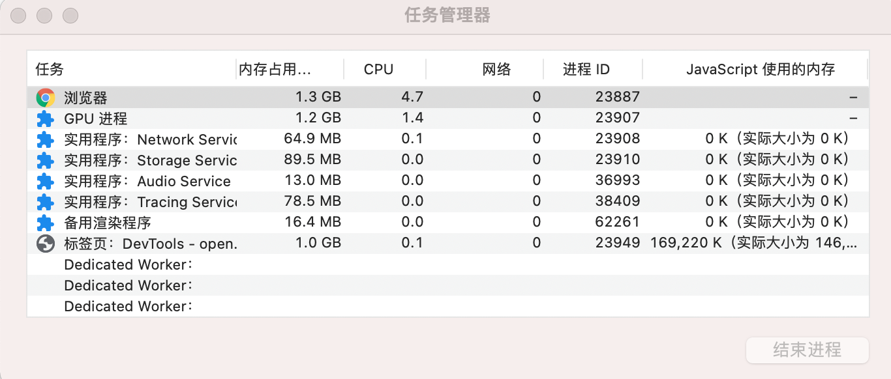

## 性能优化

## Chrome 

#### Task manager

* 工具路径：chrome右上角更多按钮 > more tools 更多工具 > Task manager 任务管理器

* 内容

  * 内存 memory 
  * js内存

  

#### menory (Profiles)

* [Fix menory problems | chrome](https://developer.chrome.com/docs/devtools/memory-problems/)

* [Chrome DevTools 之 Profiles，深度性能优化必备](https://www.jianshu.com/p/504bde348956)

* [JS内存泄漏排查方法(Chrome Profiles)](https://blog.csdn.net/jjx0224/article/details/43194513?utm_source=blogxgwz1)

  
  
  

