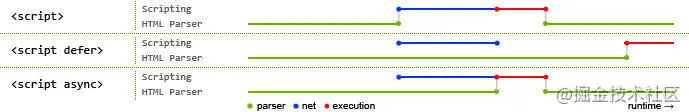

# 浏览器

## 浏览器页面渲染机制

* [你不知道的浏览器页面渲染机制 | 掘金](https://juejin.cn/post/6844903815758479374)

### async | defer




## Perfromance

* [狙杀页面卡顿 —— Performance 指北 | 掘金｜good](https://juejin.im/post/5b65105f5188251b134e9778)

### reflow repaint 

> 重排 与 重绘

* reflow:  Recalculate Style、Layout、Update Layer Tree 等渲染类型事件，

* Repaint:  Paint 和 Composite Layers 这些绘制类型事件。

* 重排之后必然会造成重绘，而造成重绘的操作不一定会造成重排。

* Examples

  * Display:none 与  visibility:hidden

    > 由于计算布局需要大量时间，重排的开销远大于重绘，在达到相同效果的情况下，我们需要尽量避免重排。举个例子，如果 display: none 和 visibility: hidden 都能满足需求，那么后者更优

  *  offsetTop 与 style.top

    > 循环中多次在刚给 DOM 更新样式位置后，立即通过 offsetTop 获取 DOM 位置。这样的操作会强制启动重排，因为浏览器并不清楚上一个循环内 DOM 有没有改变位置，必须立即重新布局才能计算 DOM 位置。
    >
    > 我们的优化方案是将 offsetTop 替换成 style.top，后者虽然取的是上一帧动画的元素位置，但并不影响计算下一帧动画位置，省去了重排获取位置的过程，减少了不必要的重排。

  * 

  


## chrome浏览器开发者工具尺寸显示

> 点开发者工具里的Settings，找到Elements分类，勾选Show rulers


[简述浏览器渲染机制](https://www.jianshu.com/p/05eb1b17b298)

[浏览器相关原理(面试题)详细总结一](https://mp.weixin.qq.com/s?__biz=MzI5MjUxNjA4Mw==&mid=2247485316&idx=1&sn=f27a088ca6665563039deeef66fba696&chksm=ec017e18db76f70e4bb91660abb89673d38947a9ef7caa1b568529587ea694dd590af945000a&mpshare=1&scene=23&srcid=&sharer_sharetime=1571022344591&sharer_shareid=4ecc76568e47f0902b9a60f7ac6e2b72#rd)


 在开发者面板上， ctrl + shift + p 打开搜索栏，可以去选择 coverage等功能块


## chrome 全屏控制导航栏显示

*  快捷键

```
shift+command+f
```


