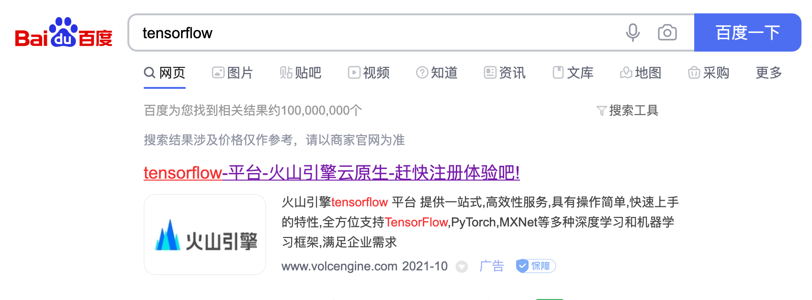
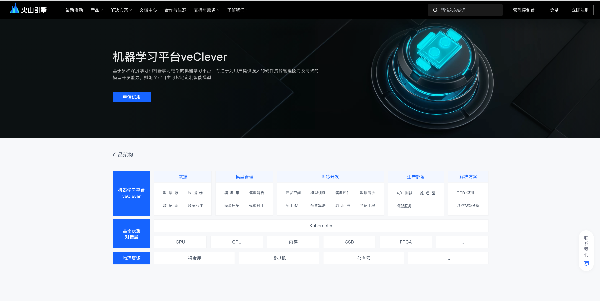
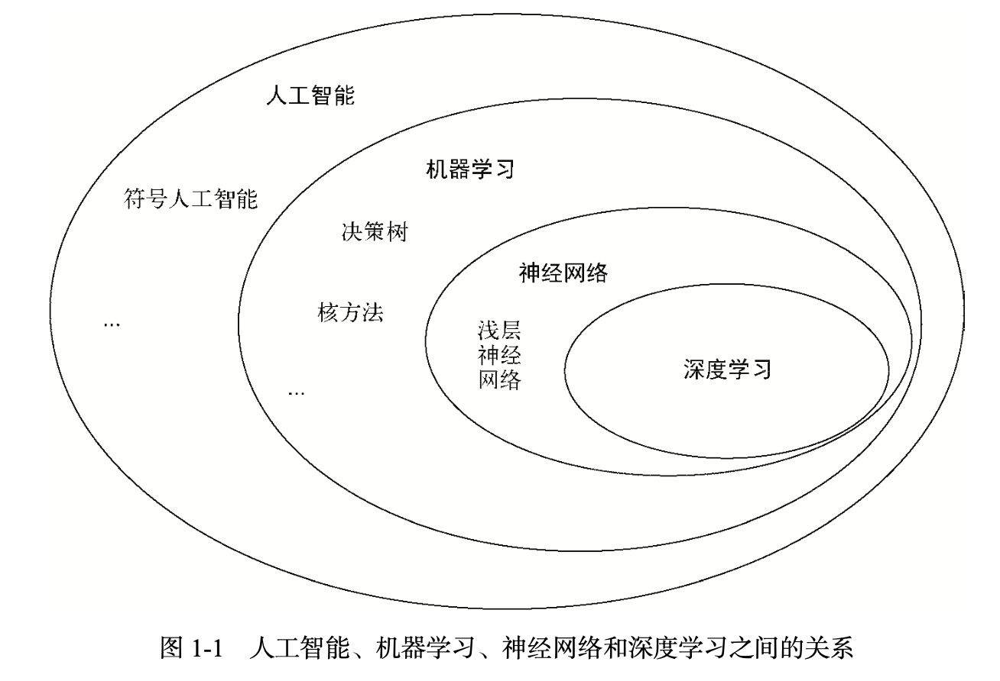
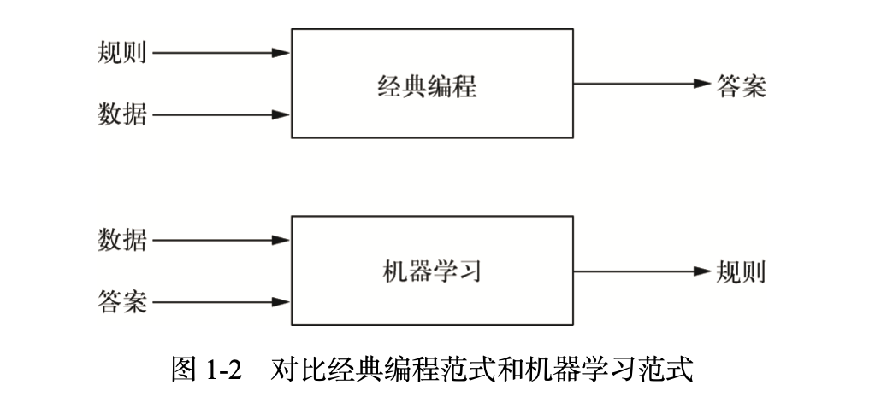
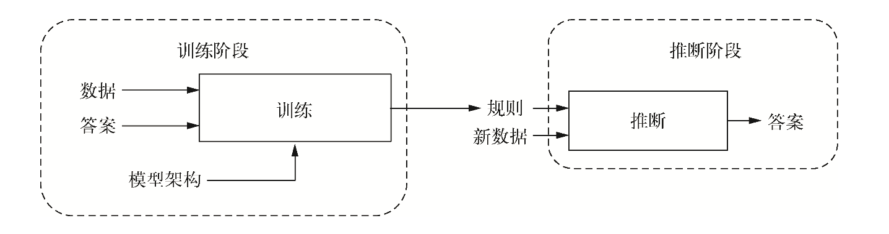
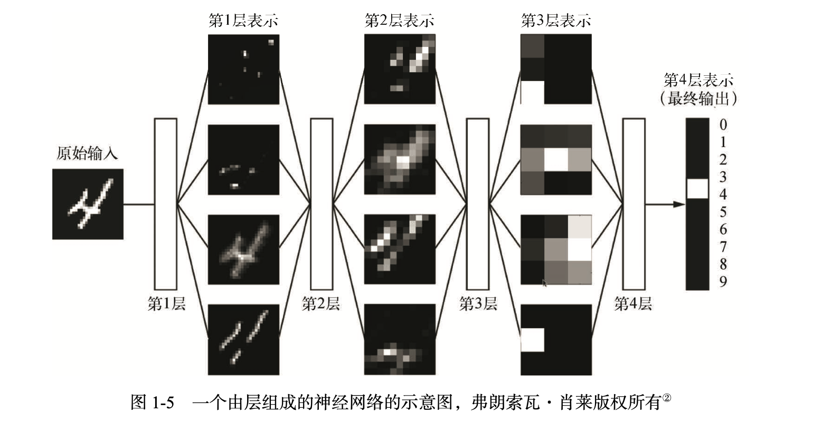
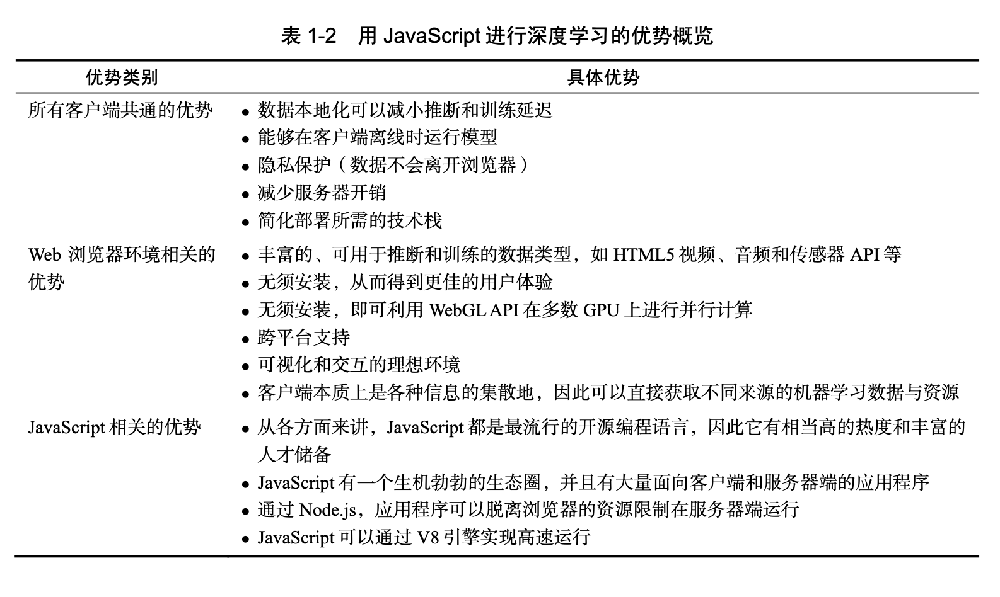

# 深度学习与tensorflow.js导学

* 链接: https://pan.baidu.com/s/12JlmAdEbLwQ_qe2TpQr9sg 提取码: 908n 

> 从传统意义上讲，JavaScript 是一种用于创建 Web 浏览器 UI 和后端业务逻辑(通过 Node.js) 的编程语言，而深度学习革命似乎是 Python、R 和 C++这些语言的专属领域。因此，作为用 JavaScript 来表达想法和发挥创造力的人。通过叫作 TensorFlow.js 的 JavaScript 深度学习库，将深度学习与 JavaScript 结合起来。如此一来， 无须学习新的编程语言，JavaScript 开发者就可以学习如何编写深度神经网络;更重要的是，我 们相信深度学习和 JavaScript 本就该在一起。

> TensorFlow.js 是 JavaScript 语言的深度学习库。TensorFlow.js 在设计上是与 TensorFlow(Python 深度学习框架)保持一致且兼容的。

## 深度学习的定义及其与人工智能的机器学习的关联

> 人工智能、机器学习、神经网络和深度学习这些词虽然意思上有一定关联，但是分别代表不 同的概念。为了系统而全面地掌握这些概念，需要理解它们各自的含义：

### 人工智能

​			 		 		 		 		 		 				 		 		 		 		 		 

> 是一个非常宽泛的领域，它的简洁定义是:试图将通常需要人类主观意识参与的任务自动化正因如此，人工智能涵盖了机器学习、神经网络和深度学习，但又包含了其他很多和 机器学习不同的策略。

### 机器学习

> 是自动发现解决复杂问题的规则的过程

> 机器学习的工作流程由两个阶段构成: 训练阶段和推断阶段。
>
> 在训练阶段中，机器自动发现数据与对应答案之间的规则， 这个过程中发现的规则会封装在训练好的模型中。它们是训练阶段的成果，并且为 推断阶段奠定基础。
>
> 推断阶段指运用习得的模型为新的数据获取答案

### 神经网络

> 神经网络是机器学习的子领域，其中实现数据表示转换的系统，其架构部分参考了人和动物 大脑中神经元的连接方式。

> 它们的数据都是通过多个可 分离的步骤进行处理的。因此，将这些步骤称为层(layer)恰如其分。这些层通常彼此叠加，只 有相邻的层之间会建立连接。展示了一个简单的含有 4 层的神经网络，这个神经网络能够 对手写数字的图像进行分类，在层与层之间可以看到原数据的表示在转换过程中形成的中间表 示。输入数据(此处是一个图像)进入第 1 层，然后按顺序一层层流入，每一 层都会对数据的表示进行一次转换。随着数据经过越来越多的层，表示会越发偏离原表示，而越 发接近神经网络的目标，那就是为输入图像打上正确的标签。当数据经过最后一层(图 1-5 的右 侧)后，就会产生神经网络的最终输出，即图像分类任务的结果。

### 深度学习

> 深度学习就是关于深 度神经网络(deep neural network)的学习和应用。而深度神经网络，简单来说，就是有很多层(通 常多达数十甚至上百层)的神经网络。在这里，深(deep)是指为数众多的连续的表示层，数据 模型拥有的层数叫作模型的深度(depth)。现代深度学习通常 包含数十至上百个连续的表示层，它们都是从训练数据中自动学习的。

## 深度学习从各种机器学习技术中脱颖而出以及引发“深度学习革命”的原因

### 神经网络不是唯一选择

> 还有其他机器学习技术：朴素贝叶斯分类器、逻辑回归、核方法、决策树、随机森林(random forest)和梯度提升机。

### 深度学习快速崛起的原因

> 主要原因是它能在很多问题上获得更好的性能，但这并不是唯一的原因。深度学习还让解决问题变得更简单，因为它能实现特征工程(feature engineering)的自动化，这一度是机器学习流程中最重要、最困难的 一步。将输入数据转换成一个或两个连续的表示空间。但是复杂问题所需 的表示更为精细，浅层学习技术无法实现。因此，人类工程师不得不在原始的输入数据上耗费更多的 精力，让它们也能够由这些技术处理。也就是说，工程师必须手动为数据设计合适的表示层，这 就是特征工程。相对而言，深度学习可以自动实现这个过程。

### 在学习数据时，深度学习有两个至关重要的特点

> 一是循序渐进、一层接一层地发展更为复杂的表示
>
> 二是在整个过程中，中间这些递进的表示层同时是被学习的，每一层的更新都会同时 兼顾上层和下层的表示需求。正是这两个特点的结合，使深度学习相比之前的机器学习策略获得 了更大的成功。

### 深度学习革命

* 神经网络的基本思想和核心技术早在 20 世纪 80 年代就已存在，为什么直到 2012 年后 才发生深度学习革命呢? 总体来说，有 3 股技术力量推动了 机器学习的发展:

  * 硬件

  > 深度学习是由实验发现而非理论引导的工程科学领域。只有当硬件条件允许尝试新想法，或 者是更为常见的放大旧想法的实验规模时，才有可能实现算法上的革新。

  * 数据集和基准

  > 如果说硬件和算法之于深度学习革命就如同蒸汽机之于工业革命，那么数据就相当于“蒸汽 机所烧的煤”。数据是这些智能机器的能量来源，没有了它，一切皆无可能。谈及数据，在过去 20 年，除了存储硬件呈指数级发展(遵循摩尔定律)，根本变化是互联网的崛起。互联网让机器 学习收集和分发大量的数据集成为可能。

  * 算法上的革新

  > 除了硬件和数据上的进步，我们还缺少训练深度神经网络(具有非常多的层)的可靠方法。当时的神经网络仍非常浅，仅使用 一到两层表示。例如 SVM 和随机森林。在 2009—2010 年发生了改变，其中的几个简单但意义重大的算法革新，让梯度传播 变得更为有效。只有当改进可以训练 10 层或更多层的模型时，深度学习才会大放异彩。终于， 2014—2016 年出现了一些更为高级的帮助梯度传播的方法，包括批标准化(batch normalization)、 残差连接(residual connection)和深度可分离卷积(depthwise separable convolution)。现在，我 们已经可以从头训练有上千层的深度神经网络模型了。

##  使用 JavaScript 和 TensorFlow.js 进行深度学习的原因

与 AI 和数据科学的其他分支一样，机器学习通常使用传统的后端编程语言来实现，比如 Python 和 R，这些编程语言在 Web 浏览器外部的服务器或工作站上运行。

### 用JavaScript进行深度学习的优势概览

### 为什么 TensorFlow.js 会脱颖而出呢?

TensorFlow.js 既不是深度学习领域唯一的 JavaScript 库，也不是这方面的第一个库。

#### 第一个原因是它的全面性。

> 对于深度学习在生产环境中所涉及的所有关键流程， TensorFlow.js 是目前唯一全部支持的库，它包括以下特性。

* 支持训练和推断。
*  支持 Web 浏览器和 Node.js 两种环境。
* 能够利用 GPU 加速(在浏览器中使用 WebGL，在 Node.js 中使用 CUDA 核函数)。
* 支持用 JavaScript 定义神经网络模型架构。
* 支持模型的序列化和反序列化。
* 支持与 Python 深度学习框架间的双向模型格式转换。
* 兼容 Python 深度学习框架使用的 API。
* 内置数据获取和可视化所需的 API

#### 第二个原因是生态圈

* 绝大部分 JavaScript 深度学习库会定义风格迥异的专属 API，相较而言， TensorFlow.js 与 TensorFlow 和 Keras 是深度集成的。
* 还有一点需要注意，那 就是 TensorFlow.js 的流行度和它背后社区的力量。TensorFlow.js 的开发者致力于长期维护和支持 该库，从 GitHub 上的星级和复制数量，到外部贡献者的数量，从各种讨论的活跃度，到 Stack Overflow 上相关提问和回答的数量，这些方面都能够说明 TensorFlow.js 的无可替代性。

###  应用场景

*   谷歌的 Magenta 项目使用 TensorFlow.js 来运行 RNN 和其他类型的深度神经网络，从而在 9 浏览器中自动生成乐谱和新颖的音律(参见 Magenta 网站的 Demos 界面) 
  * https://magenta.tensorflow.org/demos/web/

* MetaCar 是在浏览器中实现的自动驾驶模拟器。其中，用 TensorFlow.js 实现的强化学习算 法是成功模拟的关键
  * https://github.com/thibo73800/metacar
*   Canvas Friends 是一个基于 TensorFlow.js 的 Web 应用程序，可以通过游戏化的方式帮助用 户提高绘画技能

