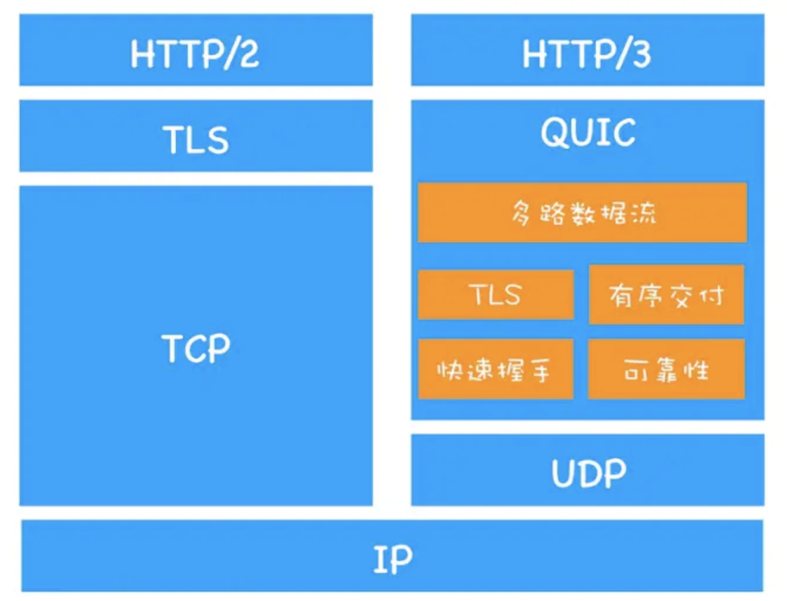

# 计算机网络


## good文章

* [2020年大厂面试指南-网络篇](https://juejin.im/post/5e44e17a518825491b11bd63)
* [WebSocket 教程 | 阮一峰](http://www.ruanyifeng.com/blog/2017/05/websocket.html)
* [理解RESTful架构 2011| 阮一峰](http://www.ruanyifeng.com/blog/2011/09/restful.html)
* [带你理解加密、Hash和签名](https://blog.csdn.net/lvzishen123/article/details/86141958)
* [http状态码](http://47.98.159.95/my_blog/http/004.html#_1xx)
* [细说浏览器输入URL后发生了什么 | winty](https://juejin.im/post/5e32449d6fb9a02fe4581907)
* [谈谈 HTTPS](https://juejin.im/post/59e4c02151882578d02f4aca)
* [HTTP协议原理详解及应用]( https://juejin.im/post/5b30dd496fb9a00e925bde2e )
* [JSON Web Token 入门教程]( http://www.ruanyifeng.com/blog/2018/07/json_web_token-tutorial.html )
* [💗前端需要了解的计算机网络知识， 这一篇就够了！(图文并茂，万字长文，点赞收藏哦！)](https://juejin.im/post/6844904079974465544)
* [什么是CDN | 知乎](https://www.zhihu.com/question/37353035)


## CDN

> **全称**:Content Delivery Network或Content Ddistribute Network，即内容分发网络

* 基本思路：

> 通过在网络各处放置节点服务器，在现有网络之上构成一层智能虚拟网络，它能实时将请求重新导向离用户最近的服务节点，通过分析网络流量、各节点连接和负载状况以及离用户的距离和响应时间等综合信息。

* 目的：

> 


## websocket

> WebSocket 是一种网络传输协议，可在单个 TCP 连接上进行全双工通信，位于 OSI 模型的应用层。

* [你不知道的 WebSocket | 掘金](https://juejin.im/post/5f1ef215e51d453473206df6)

  

## http 协议特点

> 简单快速、灵活、无连接、无状态


## http 版本演变

> [HTTP1.0、HTTP1.1 和 HTTP2.0 的区别](http://mp.weixin.qq.com/s/GICbiyJpINrHZ41u_4zT-A)
>
> [http发展史(http0.9、http1.0、http1.1、http2、http3)梳理笔记 |掘金 | good](https://juejin.im/post/5dbe8eba5188254fe019dabb)
>
> 


### http/0.9

> 于1991提出
>
> 需求简单：用于传递HTML超文本的内容

* HTTP都是基于TCP协议
* 只有一个请求行，如 GET /index.html
* 文件内容以ASCII字符流传输


### http/1.0

> 支持更多多种文件

* 设置了请求头与响应头来协商，文件的类型，压缩方案，编码格式，内容语言。

  * 请求头

  ```http
  accept: text/html
  accept-encoding: gzip, deflate, br
  accept-Charset: ISO-8859-1,utf-8
  accept-language: zh-CN,zh
  ```

  * 响应头

  ```http
  content-encoding: br
  content-type: text/html; charset=UTF-8
  ```

* 服务器响应头引入状态码

* 提供Cache机制

* User Agent  用户代理字段


### http/1.1

* 增加了持久链接的方法，字段：Connection，对同一个域名，默认允许同时建立6个TCP持久连接

* 提供虚拟主机支持：一台物理主机绑定了多个虚拟主机，多个域名公用一个IP地址，所以增加了 Host 字段

* 对动态生成的内容提供了完美支持：引入Chunk transfer机制， 服务器将数据分割成活干个数据块，并附带上个数据块长度，最后以零长度的块，作为发送完成的标志。

* 引入 cookie， 安全机制

  

* http/1.1 存在的问题

  > 对带宽利用率不高，原因如下

  * TCP的慢启动
  * 多个TCP链接，会竞争固定带宽
  * 队头堵塞：请求未结束，就会堵塞其他请求

  

### http/2.0

> 多路复用：引入二进制分帧层

* 一个域名只使用一个TCP链接
* 每个请求都有个ID，可以并行请求, 数据分帧传输，可以及时转换响应任务，让关键js,css请求优先响应。


### http/3.0

> `QUIC`协议 (Quick UDP Internet Connections，快速UDP互联网连接)
>
> 基于UDP实现了类似于 TCP的多路数据流、传输可靠性等功能





## http 版本协商(upgrade)

* [谈谈 HTTP/2 的协议协商机制](https://imququ.com/post/protocol-negotiation-in-http2.html)


 ## TCP/IP五层模型

### 应用层

为应用程序提供网络访问服务及应用层协议存留的地方。例如，HTTP协议提供了Web文档的请求和传送，SMTP（邮件传送协议）提供了电子邮件的传送，还有DNS（域名解析协议）将http://202.108.22.5转换为对人友好的www.baidu.com。

### 传输层

提供端到端的服务，即主机到主机。负责将应用层的报文向目的地传送，还要确保传输差错控制和流量控制。在因特网中，有两个传输协议，即TCP和UDP，可提供端到端的、可靠的或者不可靠的传输。

### 网络层

网络层负责将数据报的分组从一台主机移动到另一台主机，具体功能包括寻址、路由选择、连接建立、保持和终止等。在发出传输请求的主机中的传输层向网络层递交传输报文段和目的地址，就像你通过快递服务寄件时提供目的地址一样。

### 数据链路层

数据链路层最基本的服务就是将源自网络层的数据可靠地传输到相邻节点，下一个节点的目的主机的链路层将数据报上传给网络层。数据链路层的例子有以太网、WiFi等，该层需要实现的功能包括：物理地址寻址、数据的成帧、流量控制、数据的检错、重发等。

### 物理层

物理层的任务是将该帧中的一个一个比特从一个节点向下一个节点移动。在物理层中的协议与链路相关，并且需要确保原始的数据可在各种物理媒体上传输。比如以太网的许多物理层协议有和双绞铜线、同轴电缆、光纤，等等相关。